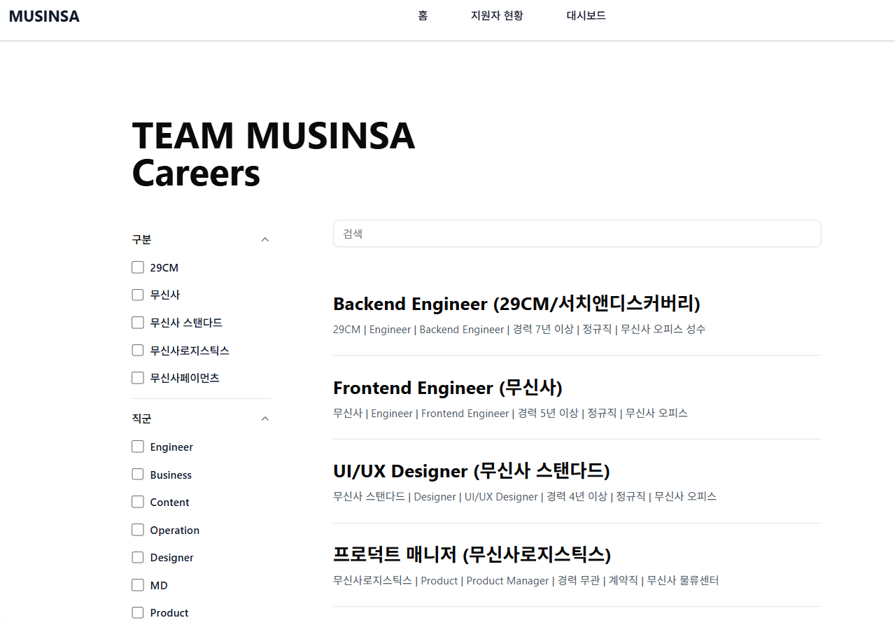
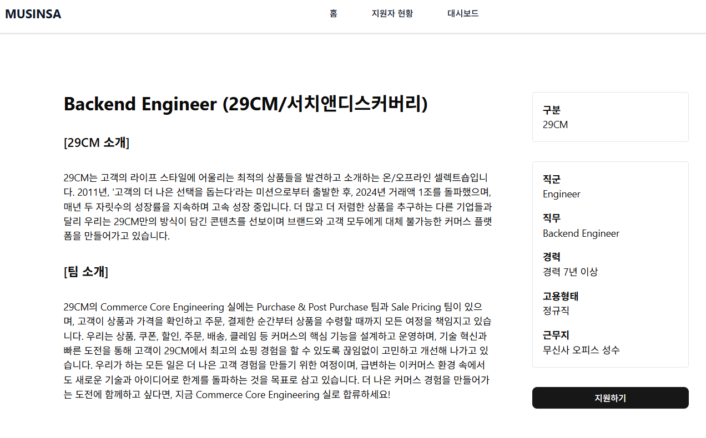
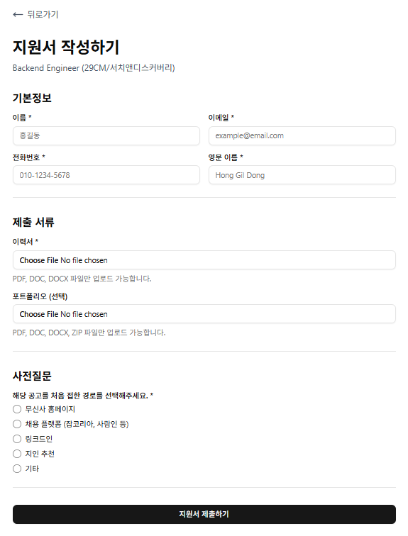
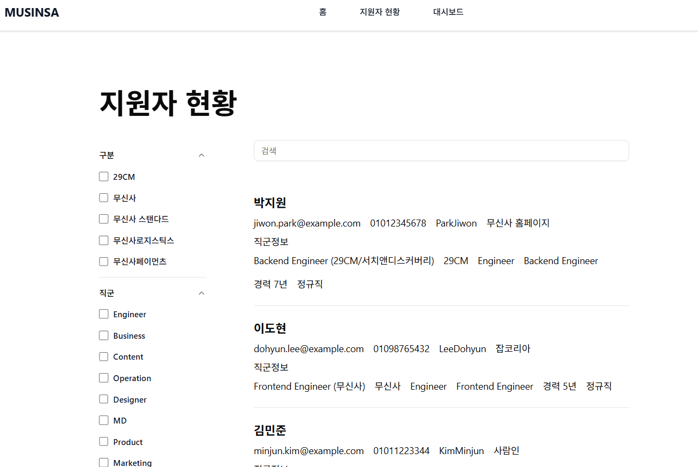
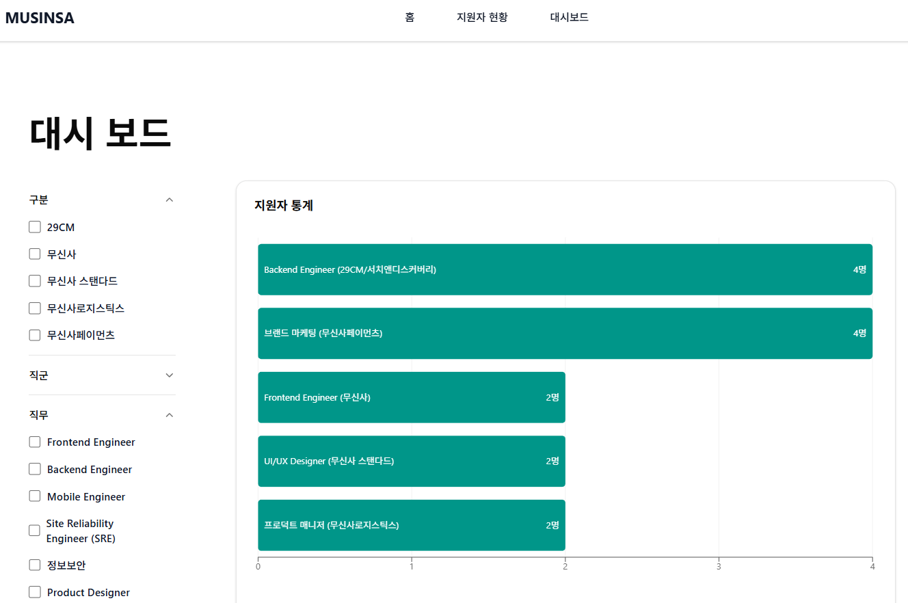

# musinsa-assignment

무신사 Frontend Engineer Assistant (채용 시스템) 사전 과제

## Tech Stack

- Frontend: React, Next.js, Tailwind CSS, Shadcn/ui,Tanstack-query
- Backend: Nest.js, MySQL

## 주요 기능

### 채용공고 리스트 보기

- API를 호출하여 현재 오픈되어 있는 "채용공고" 목록을 불러올 수 있다.
- 필터링 기능이 있어 구분, 직군, 직무, 경력사항, 고용형태를 기준으로 원하는 공고만 볼 수도 있다. 필터링 목록은 모두 URL에 parameter로 저장되어 새로고침하여도 필터링이 초기화되지 않는다.

### 채용공고 상세보기

- 각 채용공고를 클릭하면 상세보기 페이지로 이동한다.
- URL에 있는 채용공고의 고유 ID를 가져와 API를 호출하여 해당 채용공고의 상세 정보를 UI에 보여준다.

### 지원서 작성하기

- 이름, 이메일, 전화번호, 영문 이름, 이력서, 포트폴리오, 사전질문을 입력 후 API를 통해 서버로 전송한다.
- 이력서와 포트폴리오는 파일의 형태로 서버의 "uploads" 폴더에 저장되며 해당 파일이 저장된 URL을 추출한 후 다른 값들과 함께 DB에 저장된다.

### 지원자 현황

- 필터링 기능이 있어 구분, 직군, 직무, 경력사항, 고용형태를 기준으로 원하는 공고만 볼 수도 있다. 필터링 목록은 모두 URL에 parameter로 저장되어 새로고침하여도 필터링이 초기화되지 않는다.

### 대시보드

- React에서 사용 가능한 recharts라는 라이브러리로 구현
- 각 채용공고 별 지원자 수가 나타난 통계화면을 볼 수 있다.
- 필터링 기능이 있어 구분, 직군, 직무, 경력사항, 고용형태를 기준으로 원하는 공고만 볼 수도 있다. 필터링 목록은 모두 URL에 parameter로 저장되어 새로고침하여도 필터링이 초기화되지 않는다.

## 주요 화면

### 홈 화면

### 채용공고 상세보기 화면

### 지원서 작성 화면

### 지원자 현황 화면

### 대시보드 화면

